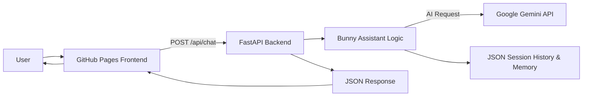

# 🐰 Bunny AI Assistant

<p align="center">
  
  
  
  
  
</p>

<p align="center">
  <b>A friendly, web-based personal AI assistant built with Python, FastAPI, HTML, CSS and JavaScript, powered by Google's Gemini API.</b>
</p>

<p align="center">
  <a href="https://anup-prasad008.github.io/Bunny-AI-Assistant/">Live Demo</a>
  &nbsp;•&nbsp;
  <a href="https://github.com/Anup-Prasad008/Bunny-AI-Assistant">Repository</a>
  &nbsp;•&nbsp;
  <a href="https://bunny-ai-backend.onrender.com/docs">API Docs</a>
</p>

---

## ✨ Overview

**Bunny AI Assistant** is a personal AI chatbot created by **Anup Prasad**.

The project combines a modern browser-based chat interface with a Python backend and Google's Gemini API. Bunny is designed to handle normal conversational requests while also providing practical built-in utilities such as arithmetic operations, BODMAS-style expression evaluation, number-system conversion, website/search actions, music search, date/time responses, session history and conversation-memory summarization.

The application is split into two layers:

- **Frontend:** responsive single-page chat interface built with HTML, CSS and vanilla JavaScript.
- **Backend:** FastAPI service that manages sessions, routes requests to Bunny's assistant logic and integrates with Gemini.

---

## 🚀 Live Project

### Frontend

**Bunny AI Web App**  
https://anup-prasad008.github.io/Bunny-AI-Assistant/

### Backend

**Bunny AI FastAPI Service**  
https://bunny-ai-backend.onrender.com/

### Health Check

https://bunny-ai-backend.onrender.com/api/health

### Interactive API Documentation

https://bunny-ai-backend.onrender.com/docs

> The frontend and backend are deployed separately.

---

## 🎯 Project Goals

Bunny AI was created to explore and demonstrate:

- AI API integration with Python
- Building a real chatbot interface without a frontend framework
- FastAPI REST endpoint design
- Session-based conversational context
- Lightweight persistent chat history and memory
- Safe arithmetic expression evaluation
- Browser voice input
- Human-friendly command detection
- Frontend/backend deployment as separate services

---

# 🧠 Core Features

## 💬 Gemini-Powered Conversations

Bunny can process natural-language requests through Google's Gemini API and return generated responses inside the chat interface.

The AI layer supports:

- Conversational context
- System instructions for Bunny's personality
- User/assistant message history
- Configurable Gemini model selection
- Configurable generation temperature
- Configurable output token limit

### Default Model

```text
gemini-flash-lite-latest
```

The model can be overridden through the:

```text
GEMINI_MODEL
```

environment variable.

---

## 🧮 Built-In Calculator

Bunny contains its own arithmetic evaluator, allowing common mathematical expressions to be processed without sending every calculation to the AI model.

### Examples

```text
2 + 5 * 3
10 / 2
25 % 4
2 ** 5
```

### Supported Operations

- Addition
- Subtraction
- Multiplication
- Division
- Modulo
- Exponentiation
- Parentheses
- Unary plus/minus

The evaluator uses Python's AST parser with an explicit operator allow-list.

---

## ➕ Multi-Number Arithmetic Commands

Bunny supports command-style calculations such as:

```text
sum 10 20 30
add 5 10 15
sub 100 25 10
mul 2 3 4
div 100 5 2
```

Hindi-style aliases are also supported:

```text
jod 10 20
ghata 100 25
guna 5 4
bhag 100 10
```

---

## 🔢 Number-System Conversion

Bunny can convert between:

- Binary
- Decimal
- Octal
- Hexadecimal

### Examples

```text
convert binary 1010
convert decimal 25
convert octal 17
convert hex ff
```

The response includes all four number-system representations.

---

## 🌐 Smart Website Actions

Bunny can recognize certain commands and return URL-opening actions for the frontend.

### Supported Websites

```text
open google
open youtube
open instagram
open facebook
open whatsapp
open spotify
open jiosaavn
```

### Search Commands

```text
google search Python FastAPI
youtube search Python tutorial
spotify search lo-fi music
```

### Weather Search

```text
weather in Delhi
```

Weather requests are converted into a Google search action.

> Bunny opens/searches web destinations through browser URLs. It does not directly control the operating system.

---

## 🎵 Music Search

Bunny can convert music requests into YouTube search actions.

### Examples

```text
play music Arijit Singh
song lo-fi beats
music relaxing songs
gaana romantic songs
```

---

## 📅 Date & Time

The backend handles basic time/date commands locally.

Supported commands include:

```text
time
date
samay
tarikh
```

---

## 🧠 Session History & Memory

Bunny maintains conversation context using session IDs.

The backend supports:

- Session IDs
- Conversation history
- Memory summaries
- Session clearing
- Session deletion
- Memory retrieval

After enough conversation, Bunny can generate a compact summary containing useful context such as topics discussed, user preferences and important information.

The current implementation stores lightweight state using JSON files in the backend `data/` directory.

---

## 🎙️ Browser Voice Input

The frontend includes browser-based voice input using the Speech Recognition API when supported.

The application checks browser support through:

```javascript
window.SpeechRecognition
```

and:

```javascript
window.webkitSpeechRecognition
```

Voice availability depends on the browser and environment.

---

## 🧹 Conversation Controls

The frontend includes:

- New Chat
- Clear Conversation
- Reset Bunny Session
- Change API Key
- Session Memory
- Mobile Sidebar
- Keyboard message sending
- Character Counter
- Typing/Loading State

---

## 📱 Responsive Interface

The Bunny AI frontend is built with HTML, CSS and vanilla JavaScript and includes responsive support for:

- Desktop
- Tablet
- Mobile
- Adaptive chat layout
- Mobile sidebar navigation
- Modal dialogs
- Animated background
- Message states
- Responsive composer

---

# 🏗️ Architecture



---

## 🔄 Request Flow

```text
User
  │
  ▼
Browser Chat UI
  │
  │ POST /api/chat
  ▼
FastAPI Backend
  │
  ▼
Bunny Assistant
  │
  ├── Built-in Command
  │      ├── Calculator
  │      ├── Number Conversion
  │      ├── Date / Time
  │      └── URL / Search Action
  │
  └── AI Request
         │
         ▼
    Google Gemini
         │
         ▼
      AI Reply
  │
  ▼
FastAPI JSON Response
  │
  ▼
Browser UI
```

---

# 📂 Project Structure

```text
Bunny-AI-Assistant/
│
├── index.html
│
├── Backend/
│   ├── main.py
│   ├── bunny.py
│   ├── ai.py
│   ├── memory.py
│   ├── requirements.txt
│   │
│   └── data/
│       ├── chat_history.json
│       └── memory.json
│
└── README.md
```

---

## 📄 File Responsibilities

| File | Responsibility |
|------|----------------|
| `index.html` | Complete frontend interface, chat UI, settings, voice input and API communication |
| `Backend/main.py` | FastAPI application, routes, CORS and session management |
| `Backend/bunny.py` | Core assistant logic, command detection, calculations, conversions and actions |
| `Backend/ai.py` | Google Gemini integration and AI response generation |
| `Backend/memory.py` | Chat history and memory persistence |
| `Backend/requirements.txt` | Backend dependencies |
| `Backend/data/` | Runtime history and memory storage |

---

# 🛠️ Tech Stack

## Frontend

- HTML5
- CSS3
- Vanilla JavaScript
- Browser Speech Recognition API

## Backend

- Python
- FastAPI
- Uvicorn
- Pydantic

## AI

- Google Gemini API
- `google-genai`

## Persistence

- JSON
- Python `pathlib`
- Thread locking

---

# ⚙️ Requirements

Before running Bunny AI locally, install:

- Python 3.x
- Google Gemini API key
- Modern web browser
- Git (optional)

---

# 🔑 Gemini API Key

## Current Architecture

The current web frontend asks the user for a Gemini API key for the active page session.

The key is sent to the FastAPI backend when making an AI request.

The frontend is designed so the key is not stored in:

```text
localStorage
```

or:

```text
sessionStorage
```

---

## ⚠️ API Key Security

### Never:

- Hard-code your API key into `index.html`
- Commit API keys to GitHub
- Put secrets inside public source files
- Share private API keys in screenshots
- Upload API keys to public repositories

For a production multi-user application, a server-side secret-management architecture is recommended.

---

# 💻 Local Development

## 1. Clone the Repository

```bash
git clone https://github.com/Anup-Prasad008/Bunny-AI-Assistant.git
```

Then:

```bash
cd Bunny-AI-Assistant
```

---

## 2. Create a Virtual Environment

### Windows

```bash
python -m venv .venv
```

Activate:

```bash
.venv\Scripts\activate
```

### macOS / Linux

```bash
python3 -m venv .venv
```

Activate:

```bash
source .venv/bin/activate
```

---

## 3. Install Dependencies

Move into the backend:

```bash
cd Backend
```

Install packages:

```bash
pip install -r requirements.txt
```

---

## 4. Start the Backend

Run:

```bash
uvicorn main:app --host 0.0.0.0 --port 8000
```

The backend will be available at:

```text
http://127.0.0.1:8000
```

---

## 5. Check Backend Health

Open:

```text
http://127.0.0.1:8000/api/health
```

Expected:

```json
{
  "status": "ok"
}
```

---

## 6. Configure Frontend

For local development:

```javascript
const API_BASE_URL = "http://127.0.0.1:8000";
```

For production:

```javascript
const API_BASE_URL = "https://bunny-ai-backend.onrender.com";
```

---

# 🔌 API Reference

## `GET /`

Returns basic backend information.

### Example Response

```json
{
  "name": "Bunny AI",
  "status": "online",
  "message": "Bunny backend is running."
}
```

---

## `GET /api/health`

Checks whether the backend is reachable.

### Response

```json
{
  "status": "ok"
}
```

---

## `POST /api/chat`

Main Bunny AI chat endpoint.

### Request

```json
{
  "message": "Explain Python decorators",
  "api_key": "YOUR_GEMINI_API_KEY",
  "session_id": "optional-session-id"
}
```

### Response

```json
{
  "reply": "AI response here...",
  "action": null,
  "session_id": "generated-or-provided-session-id"
}
```

---

## `POST /api/session/clear`

Clears stored conversation history and memory for a session.

### Request

```json
{
  "session_id": "your-session-id"
}
```

---

## `DELETE /api/session`

Deletes stored session data.

### Request

```json
{
  "session_id": "your-session-id"
}
```

---

## `GET /api/session/{session_id}/memory`

Returns saved memory information for a session.

### Example

```text
/api/session/abc123/memory
```

---

# 🧪 Example Prompts

Try the following commands:

### General Conversation

```text
Hello Bunny
```

```text
What is Python?
```

```text
Explain FastAPI
```

### Calculator

```text
2 + 5 * 3
```

```text
sum 10 20 30
```

### Number System

```text
convert binary 1010
```

```text
convert decimal 25
```

### Web Actions

```text
open youtube
```

```text
open google
```

```text
google search Python decorators
```

```text
youtube search FastAPI tutorial
```

### Music

```text
play music lo-fi
```

### Weather

```text
weather in Delhi
```

### Time

```text
time
```

---

# ☁️ Deployment

Bunny AI uses separate deployment targets for the frontend and backend.

## Frontend

The static web application can be hosted on GitHub Pages.

Current frontend:

```text
https://anup-prasad008.github.io/Bunny-AI-Assistant/
```

## Backend

The FastAPI service is deployed on Render.

Current backend:

```text
https://bunny-ai-backend.onrender.com
```

---

# 🚀 Render Deployment

For the current repository structure, the backend can be deployed with:

### Runtime

```text
Python 3
```

### Root Directory

```text
Backend
```

### Build Command

```bash
pip install -r requirements.txt
```

### Start Command

```bash
uvicorn main:app --host 0.0.0.0 --port $PORT
```

---

# 🩺 Troubleshooting

## Frontend Says "Backend returned an empty response"

Check:

1. `API_BASE_URL` points to the deployed Render backend.
2. `/api/health` responds correctly.
3. Render service is running.
4. Render logs contain a `/api/chat` request.
5. A valid Gemini API key is being supplied.
6. The frontend reads the backend's `reply` field.

---

## Gemini API Error

Possible causes include:

- Invalid API key
- API access/configuration issue
- Model availability issue
- Quota or usage limitation
- Backend-side exception

Check the Render logs for the exact error message.

---

## Voice Input Not Working

Voice input depends on browser support.

Check:

```javascript
window.SpeechRecognition
```

or:

```javascript
window.webkitSpeechRecognition
```

If neither exists, the browser may not support the required API.

---

# ⚠️ Current Limitations

## File-Based Persistence

Conversation history and memory are stored in JSON files.

For a larger production workload, a database such as PostgreSQL or SQLite would be more suitable.

---

## In-Memory Active Sessions

The backend keeps active Bunny objects in process memory.

A restart, redeployment or multi-instance setup can affect this in-memory state.

---

## Browser-Based API Key Entry

The current implementation collects the user's Gemini API key in the frontend and forwards it to the backend per request.

For a production application, provider credentials should preferably be handled server-side.

---

## Browser Voice Support

Speech Recognition support varies between browsers and operating systems.

---

# 🔐 Security Considerations

Bunny AI is currently structured as a personal/learning project.

For production deployment, consider adding:

- Server-side secret management
- Authentication
- Authorization
- Rate limiting
- Request validation
- Abuse protection
- Database-backed persistence
- Restricted CORS
- HTTPS-only access
- Usage monitoring
- Error monitoring
- Logging without secrets

The current FastAPI application uses permissive CORS:

```python
allow_origins=["*"]
```

For a controlled production deployment, restrict this to the actual frontend origin.

---

# 🗺️ Roadmap

Future improvements may include:

- [ ] Server-side Gemini API key management
- [ ] Database-backed chat history
- [ ] User authentication
- [ ] Streaming AI responses
- [ ] Better command parser
- [ ] More utility commands
- [ ] Improved browser actions
- [ ] File upload support
- [ ] Image understanding
- [ ] Multi-user isolation
- [ ] Rate limiting
- [ ] Automated tests
- [ ] CI/CD pipeline
- [ ] Production monitoring
- [ ] Configurable Bunny personalities

---

# 🤝 Contributing

Contributions, ideas and improvements are welcome.

Create a feature branch:

```bash
git checkout -b feature/your-feature
```

Make your changes and test them locally.

Then:

```bash
git add .
git commit -m "Add: your feature"
git push origin feature/your-feature
```

Open a Pull Request with:

- What changed
- Why it changed
- How it was tested
- Screenshots when useful
- Deployment notes when relevant

---

# 👨‍💻 Author

## Anup Prasad

**Full Stack Developer • Cybersecurity Enthusiast • Author**

Bunny AI is a personal development project created by **Anup Prasad** to explore:

- Artificial Intelligence
- Gemini API integration
- Python development
- Backend engineering
- Web application development
- Conversational interfaces
- Practical automation

### GitHub

https://github.com/Anup-Prasad008

### Bunny AI Repository

https://github.com/Anup-Prasad008/Bunny-AI-Assistant

---

# 🙏 Credits & Acknowledgements

Bunny AI is built using several open-source tools, platforms and developer technologies.

## 🧠 Google Gemini

Bunny's AI conversation functionality is powered by Google's Gemini API.

**Credit:** Google

https://ai.google.dev/

---

## ⚡ FastAPI

FastAPI is used to build the Python backend and REST API.

**Credit:** FastAPI and its contributors

https://fastapi.tiangolo.com/

---

## 🚀 Uvicorn

Uvicorn is used as the ASGI server for running the FastAPI application.

**Credit:** Uvicorn / Encode contributors

https://www.uvicorn.org/

---

## ✅ Pydantic

Pydantic is used for request and response data validation through FastAPI.

**Credit:** Pydantic contributors

https://docs.pydantic.dev/

---

## 🌐 GitHub Pages

GitHub Pages is used to host the static Bunny AI frontend.

**Credit:** GitHub

https://pages.github.com/

---

## ☁️ Render

Render is used to host the Bunny AI FastAPI backend.

**Credit:** Render

https://render.com/

---

# 📜 License

No explicit `LICENSE` file is currently defined in this repository.

Before redistributing or commercially using the project, add a license that matches your intended permissions.

Third-party libraries, APIs, SDKs and platforms remain subject to their respective licenses and terms.

---

# ⭐ Support the Project

If you found Bunny AI useful or interesting:

⭐ Star the repository

🐛 Report reproducible bugs

💡 Suggest improvements

🔧 Contribute code

📢 Share the project

---

<p align="center">
  <b>Built with Python, curiosity and a lot of debugging. 🐰</b>
</p>

<p align="center">
  <sub>© 2026 Anup Prasad • Bunny AI Assistant</sub>
</p>
